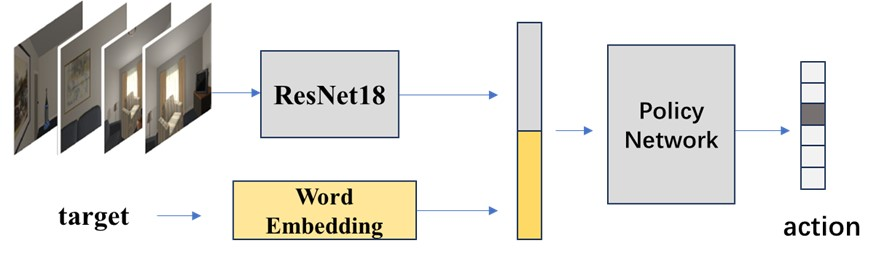

# visual-semantic-navigation-codebase

## Overview
This model is a foundational framework for visual-semantic navigation. Semantic features are extracted using the GloVe model, visual features are extracted using the ResNet18 model, and then cascaded into an A3C reinforcement learning algorithm to generate actions, thus achieving navigation. The model architecture is as follows:



## Setting up Python Environment
- Create a Python environment using conda:

```
conda create -n objNav python=3.9.12
conda activate objNav
```
- Install PyTorch:

```
pip install torch==1.12.1+cu113 torchvision==0.13.1+cu113 torchaudio==0.12.1 --extra-index-url https://download.pytorch.org/whl/cu113
```
- Clone the files:

```
git clone https://github.com/FUIGUIMURONG/visual-semantic-navigation-codebase.git
```
- Install required dependencies according to requirement.txt:

```
cd ~/visual-semantic-navigation-codebase
pip install -r requirements.txt
```
- Download the scene dataset:

Go to the following link and download the compressed file:
[Scene Dataset](https://drive.google.com/file/d/1E3wYlI2dwsg2C1rCqLaMv1W9oVg6ZI9v/view?usp=sharing)
Extract the folder to `visual-semantic-navigation-codebase/scene_data` directory.

## Training
- Activate the environment and navigate to the directory:

```
conda activate objNav
cd ~/visual-semantic-navigation-codebase
```
- Train:

```
python main.py --algorithm RL --train_or_test train
```
Optional arguments:

 `--tb_dir`: directory to save the model, default is `runs/`

 `--gpu_ids`: GPU IDs to be used, default is 3

 `--max_RL_episode`: maximum training steps, default is 1000000

 `--n_record_RL`: steps for recording training information, default is 100

 `--RL_save_episodes`: steps for model saving, default is 100000
 
- Continue training on a previously trained model:

```
python main.py --algorithm RL --train_or_test train --If_IL_pretrain True --load_IL_path xxx
```
Replace `xxx` with the path of the model to be loaded.

## Testing
- Activate the environment and navigate to the directory:

```
conda activate objNav
cd ~/visual-semantic-navigation-codebase
```
- Test:

```
python main.py --algorithm RL --train_or_test test --test_RL_load_model xxx
```
Replace `xxx` with the path of the model to be loaded.

Optional arguments:

 `--test_setting`: seen or unseen, default is seen

## Others
For more parameters, refer to `visual-semantic-navigation-codebase/utils/flag_parser.py`.
